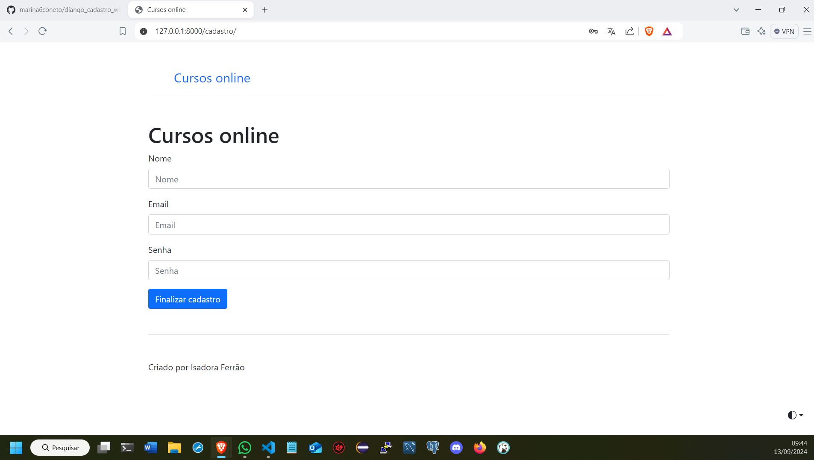
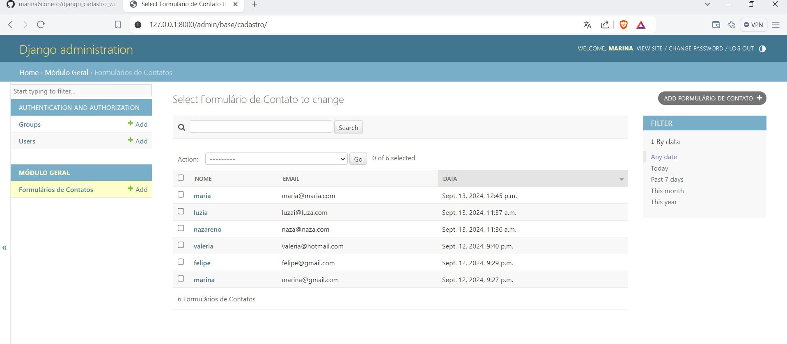

# Cadastro em Django 📚👩‍🏫

- Este projeto é um sistema de cadastro de usuários implementado em python 🐍, usando o framework django.
- Aplicação simples com o intuito de estudar e desenvolver a lógica de programação

⚠ Comandos executados apenas a primeira vez ⚠

〰Instalação do ambiente virtual

         🟣 pip install virtualenv
   
    
〰Criação do ambiente virtual

         🟣 python -m venv .venv
   
    
〰Instalação do django

         🟣 pip install django

⚠ Comando executado toda vez que for modificar o projeto ⚠

〰Ativação do ambiente virtual
  
         🟣 .\.venv\Scripts\activate

〰Comando para criação de um projeto django 

         🟣 django-admin startproject projeto_womakers .

〰Comando para rodar um projeto django

         🟣 python manage.py runserver

〰Comando para criação de um app

         🟣 python manage.py startapp base

## Screenshots
1. **Tela Inicial**  
   

2. **Tela de Cadastro**  
   

3. **Tela de Cadastro Efetuado**  
   

4. **Tela admin**  
   